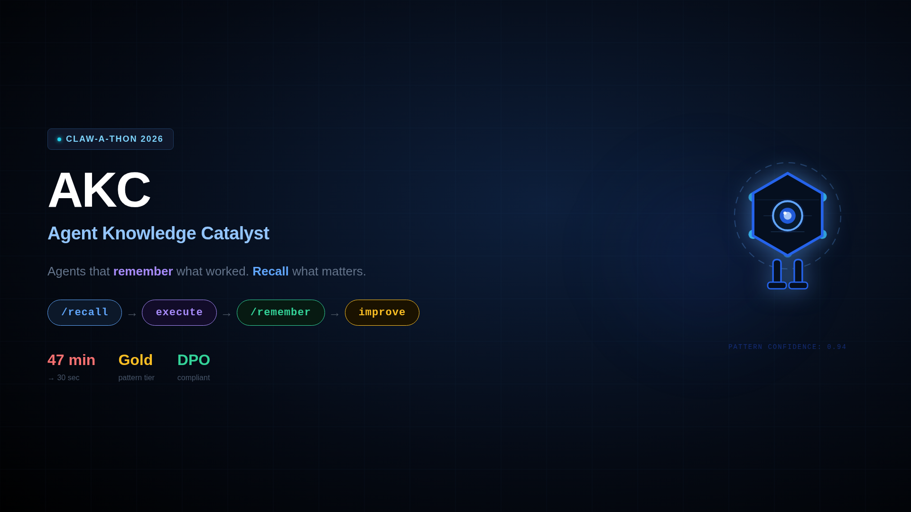

# AKC — Agent Knowledge Collectives

**The drop-in memory layer that turns any LLM agent into a team that remembers.**

AKC is a compliance-class memory infrastructure for LLM agents — a single `/recall` before planning, a single `/remember` after the outcome, and your agent compounds team knowledge across sessions, geos, and humans. Outcomes are distilled by **Gemma 4-31b-it** on **VNG's on-prem GreenNode MaaS**, scored into **Gold / Production / Experimental** tiers, and never leave the internal network — purpose-built for DPO-bound enterprises that cannot send internal data to external Claude or SaaS memory vendors. Day 1, a fresh agent cold-starts on seed patterns; by week 3, the same agent walks into a Korea launch already knowing what worked in Japan and what failed in Vietnam — no retraining, no re-onboarding, no prompt-stuffing.

- **Drop-in for any agent** — two REST endpoints (`/recall`, `/remember`), OpenAI-compatible LLM swap, works with Claude Code, OpenClaw, or your own stack
- **VNG-compliant by construction** — runs on GreenNode AgentBase Runtime, distilled by on-prem Gemma 4-31b-it, zero external data egress (DPO-approved reference deployment)
- **Compound learning, visible** — Scene 1 cold-start on JP launch → Scene 2 a pattern crosses Gold tier live on screen as KR success carries JP learnings forward

> Built for Anthropic's Claw-a-thon 2026 — Track: **Automation & Integration**

## Demo Video

[](https://www.youtube.com/watch?v=bTayoG7jEQw)

## 🌐 Try Live Demo

Verify AKC end-to-end against the live AgentBase deployment:

- **REST API health:** https://endpoint-30123c53-b859-4599-a339-94b2cedabf7b.agentbase-runtime.aiplatform.vngcloud.vn/health
- **MCP server:** https://endpoint-8976bc68-ff8c-48fc-8045-79e0a38c2762.agentbase-runtime.aiplatform.vngcloud.vn/mcp
- **Web demo (local):** `cd webdemo && npm install && npm run dev` — 3-column chat UI calling the live backend

> Both AgentBase endpoints are live on VNG GreenNode and shared with the local web demo.

## 🚀 Pick Your Path — Onboarding in 60s

Choose the entry that matches your tooling. Each row links to a 5-min setup guide.

| Audience | Path | Setup | Auto-fire | Guide |
|---|---|---|---|---|
| 🌐 **Judge / non-dev** | **Web demo** (local Next.js) | `npm install && npm run dev` | n/a | [`webdemo/`](webdemo/) |
| 🖥️ **Knowledge worker** | **Claude Desktop App** | 1 min (paste config) | Project Instructions | [`docs/cowork-setup.md`](docs/cowork-setup.md) |
| ⌨️ **Developer (CLI)** | **Claude Code** | 30s (clone skill) | UserPromptSubmit hook ✅ | [`ONBOARDING.md`](ONBOARDING.md) |
| 🧩 **Cursor / Codex / Antigravity** | **Generic MCP client** | 2 min | Tool-call from agent prompts | [`docs/cowork-setup.md`](docs/cowork-setup.md) (Generic MCP) |
| 🔌 **Backend integrator** | **REST API direct** | 0s — just `curl` | n/a | [`docs/test-guide-anh-duc.md`](docs/test-guide-anh-duc.md) |

**TL;DR copy-paste for MCP-capable clients:**

```
MCP URL: https://endpoint-8976bc68-ff8c-48fc-8045-79e0a38c2762.agentbase-runtime.aiplatform.vngcloud.vn/mcp
Project Instructions block:
  Before a non-trivial task, call akc_recall(task_context, tags) and cite returned pattern IDs.
  After a substantive outcome, call akc_remember(task_context, outcome, patterns_used, success).
```

## Live Deployment

AKC is deployed on GreenNode AgentBase Runtime:

**Endpoint**: `https://endpoint-30123c53-b859-4599-a339-94b2cedabf7b.agentbase-runtime.aiplatform.vngcloud.vn`

Quick verify:
```bash
curl -sf https://endpoint-30123c53-b859-4599-a339-94b2cedabf7b.agentbase-runtime.aiplatform.vngcloud.vn/health
# → {"status":"ok","pattern_count":30}
```

See `docs/test-guide-anh-duc.md` for full test suite (covers all 5 endpoints + PRD compliance matrix).

**Demo client paths**:
- **Claude Code skill** (current): install `skill/SKILL.md`, set `AKC_ENDPOINT`, AI auto-fires recall+remember on tasks
- **OpenClaw no-code workspace** (optional bonus): provision OC instance on AgentBase, paste workspace config from [`docs/openclaw-integration.md`](docs/openclaw-integration.md) — stronger Automation pitch

## What AKC does

- **Structured patterns** (not chat logs): each entry has `context`, `what_worked`, `what_failed`, `tags`, `confidence`
- **Tier system** (Gold ≥0.85, Production ≥0.70, Experimental ≥0.50, Demoted <0.50) — high-confidence patterns surface first; wrong advice auto-demotes
- **Self-improving loop**: `/recall` fetches guidance, agent executes, `/remember` reports outcome → patterns rise/fall by confidence
- **30-pattern seed** (5 Gold, 10 Production, 15 Experimental) including 10 ASO-specific patterns for multi-geo app launch workflow
- **Compliance-class architecture**: runs on internal AgentBase, no internal data crosses to external AI providers (VNG DPO-approved reference deployment)

### What to expect on Day 1

A fresh AKC runtime starts with an **empty KB** (or 30 seeded patterns if you keep the demo seed). `/recall` returns nothing until you log a few outcomes. **Practical expectations**: by task ~20, recall surfaces useful patterns; by task ~100, recall is sharper than any hand-curated team wiki because patterns are scored by actual outcomes, not author intent. The starter kit ships with 30 demo patterns (including 10 ASO domain examples) so judges see a representative state immediately.

## How AKC compares

| Capability | AKC | mem0 | Letta (MemGPT) | ChatGPT Memory | Claude Projects | Fine-tuning |
|---|---|---|---|---|---|---|
| Team-shared scope | ✅ Native | Per-user | Per-agent state | Per-user only | Per-project (manual) | Per-model |
| Auto-write from outcomes | ✅ `/remember` distill | ✅ (chat-summary) | ✅ (chat-history) | ✅ (chat-summary) | ❌ Manual paste | ❌ Static |
| Auto-read before tasks | ✅ `/recall` | ✅ | ✅ | Implicit | Implicit | Baked in |
| Confidence-tiered (self-correcting) | ✅ Gold guardrail | ❌ Flat | ❌ Flat | ❌ Flat | ❌ Flat | ❌ Frozen |
| Compliance-friendly deploy | ✅ Self-host on AgentBase | SaaS-first | SaaS or self-host | SaaS only | SaaS only | Self-host possible |
| Outcome → structured Pattern | ✅ {what_worked, what_failed} | Chat summary | Chat snippets | Chat summary | Free-form notes | n/a |
| Cost per write | ~$0.001 (LLM distill) | $0.001-0.01 | $0.001-0.01 | Included | Included | $1000s+ training |

**AKC's unique angle**: tier-based confidence with 3-failure Gold guardrail. Bad patterns demote within 3 failures; neither mem0 nor Letta has this self-correction mechanism. Closest alternatives optimize for recall hit rate; AKC optimizes for **trust calibration over time**.

## Installation

### Option A — Local (no Docker)

**Requirements:** Python 3.11+

```bash
git clone https://github.com/kabuto-png/dl-starter-kit.git
cd dl-starter-kit
pip install -r requirements.txt
```

Create a `.env` file (copy and fill in your credentials):

```bash
LLM_MODEL=google/gemma-4-31b-it
LLM_BASE_URL=https://maas-llm-aiplatform-hcm.api.vngcloud.vn/v1
LLM_API_KEY=your-api-key
MEMORY_ID=memory-d9b9d688-9a28-446c-841a-c70b59cdc446
AKC_KB_DIR=./kb_data
GREENNODE_CLIENT_ID=your-client-id
GREENNODE_CLIENT_SECRET=your-client-secret
GREENNODE_AGENT_IDENTITY=dl-starter-kit
```

Start the server:

```bash
uvicorn main:app --host 0.0.0.0 --port 8080
```

### Option B — Docker Compose

```bash
git clone https://github.com/kabuto-png/dl-starter-kit.git
cd dl-starter-kit
```

Export your credentials, then build and start:

```bash
export LLM_MODEL=google/gemma-4-31b-it
export LLM_BASE_URL=https://maas-llm-aiplatform-hcm.api.vngcloud.vn/v1
export LLM_API_KEY=your-api-key

docker compose up --build
```

The service is ready when you see `AKC starting — KB_DIR: /app/data, patterns: 0` in the logs.
Patterns are persisted in `./kb_data/` on the host.

## Quick Start

Verify the service is running:

```bash
curl http://localhost:8080/health
```

Expected response: `{"status": "ok", "pattern_count": 0}`

Seed demo data (30 patterns: 5 Gold, 10 Production, 15 Experimental — includes 10 ASO-specific patterns):

```bash
# Local
python scripts/seed_kb.py --kb-dir ./kb_data

# Docker (run against the mounted volume)
python scripts/seed_kb.py --kb-dir ./kb_data
```

Distribution: 2 ASO in Gold + 4 in Production + 4 in Experimental (default `--tier-mix gold:5,production:10,experimental:15`).

Check the KB loaded the patterns:

```bash
curl http://localhost:8080/health
# {"status": "ok", "pattern_count": 30}
```

## Testing the Core Loop

**Via Claude Code skill** (automates recall → execute → remember):

```bash
/akc-recall-task-remember --task "localized keyword research for Japan iOS launch" --endpoint http://localhost:8080
```

Manual REST calls:
```bash
# Recall: fetch patterns matching a task
curl -X POST http://localhost:8080/recall -H "Content-Type: application/json" \
  -d '{"task_context": "localized keyword research", "top_k": 3}'

# Remember: feed back outcome
curl -X POST http://localhost:8080/remember -H "Content-Type: application/json" \
  -d '{"task_context": "localized keyword research", "outcome": "success", "patterns_used": ["<id>"]}'

# Stats: check tier distribution
curl http://localhost:8080/stats | python3 -m json.tool
```

## API Reference

| Endpoint | Method | Purpose |
|----------|--------|---------|
| `/health` | GET | Service health + pattern count |
| `/recall` | POST | Fetch high-confidence patterns ranked by confidence, optionally filtered by tags/tier |
| `/remember` | POST | Learn from task outcome; update pattern confidence async (202 Accepted) |
| `/stats` | GET | KB health: tier distribution, avg confidence, top tags, recently promoted |
| `/kb/export` | POST | Export Gold + Production patterns as markdown |

Full API schema: See `docs/prd/AKC_PRD.md` §5 (Calls & Responses).

## Demo: 2-Scene ASO Workflow

**Persona:** ASO Specialist at VNG Publishing, launching apps across JP / KR / VN / TH / PH geos.

**Scene 1** — JP cold start: Specialist calls `/recall` with task context "localized keyword research for Japan iOS launch". AKC returns top-3 Gold ASO patterns (e.g., "kanji vs. romaji keyword strategy"). Specialist applies guidance, files 5 primary keywords.

**Scene 2** — KR compound recall: Later session, new KR launch task triggers `/recall` → returns different geo-specific patterns. Specialist applies, sees success, calls `/remember` with outcome → pattern confidence rises. Meanwhile, failed KR title strategy from Scene 1 demotion is excluded from next recall (stays Demoted). System shows only high-confidence patterns per geo.

See storyboard: `plans/260613-0000-clawathon-L/storyboard-demo-2scene.md`

## Claude Code Skill Integration

Automates the loop via slash command:

```bash
/akc-recall-task-remember --task "localized keyword research for Japan iOS launch" --endpoint http://localhost:8080
```

Skill handles: recall → execute → remember → report (confidence deltas, tier shifts, new patterns).
Skill file: `.claude/skills/akc-recall-task-remember/SKILL.md`

## Confidence Engine

Every pattern has a score (0.0–0.95) determining its tier:

| Tier | Confidence | Behavior |
|---|---|---|
| **Gold** | ≥ 0.85 | Highest priority; requires 3 consecutive failures to demote |
| **Production** | ≥ 0.70 | Default minimum for recall |
| **Experimental** | ≥ 0.50 | Returned only with `min_tier=experimental` |
| **Demoted** | < 0.50 | Permanently excluded; never resurfaces |

**Deltas per `/remember` call:** success → +0.05, failure → −0.10
**Initial confidence:** 0.67 (experimental). ~4 successes → production, ~7 → gold, ~2 failures → demoted.

## Architecture

**Recall:** POST /recall → AgentBase Memory Service (semantic, 2s timeout) or JSONL fallback → filter by tier/tags → rank by confidence → return top-k

**Remember:** POST /remember → 202 Accepted → background task → optional Gemma 4-31b distillation → update confidence → tier re-evaluation → append to patterns.jsonl

**Storage:** JSONL (atomic write via tempfile + os.replace) + confidence_history.jsonl audit log. Mountable Docker volume for persistence.

## Tech Stack

| Component | Technology |
|-----------|------------|
| Framework | FastAPI (Python 3.11+) |
| LLM | Gemma 4-31b-it (OpenAI-compatible) via GreenNode MaaS — A/B chosen for 9x latency vs MiniMax at parity JSON quality |
| Storage | JSONL append-only + AgentBase Memory Service (semantic recall) |
| Deployment | Docker; GreenNode AgentBase Runtime |
| Confidence Engine | Bayesian update with Beta(2,1) prior (init 0.67) + Gold guardrail (3 failures to demote) |
| Compliance | VNG-internal, no external AI on internal data (DPO-approved) |

## Known Limitations (v1)

- No API authentication (all callers trusted in MVP)
- Single KB per runtime (no multi-tenant routing)
- No cross-node KB sync (each runtime has its own patterns)
- LLM locked to Gemma 4-31b-it (any OpenAI-compatible model swappable via `LLM_MODEL`)

## Trust Model (MVP)

AKC v1 is designed for **internal, trusted callers** behind a corporate firewall (e.g., VNG internal network). The threat model assumes:

- All `/remember` callers are authenticated team members (not anonymous)
- The runtime endpoint is not publicly exposed
- Patterns may contain non-secret team knowledge; `.env` and credentials are never sent through `/remember`

**Out of scope (Phase 2)**:
- API key authentication per caller
- Rate limiting + per-caller quotas
- Adversarial input detection (sybil-resistance, content filtering)
- Multi-tenant KB scoping (one KB per team/project)
- PII/secret redaction in `outcome` strings

Audit trail is provided via `/kb/export` (Gold + Production patterns as markdown) for periodic review.

## Project Status

**Submission Date:** 2026-06-17 12:00 (Asia/Saigon)
**Backend:** Complete (16 feature commits, 2 audit rounds)
**Direction:** LOCKED — Level L (REUSE-MAX: 30 generic + 10 ASO patterns + 2-scene demo)
**Deploy:** Pending AgentBase Runtime creation (vCR access cleared D4, D5 target: Docker build + push + Runtime create)

---

Built for Anthropic's Claw-a-thon 2026
