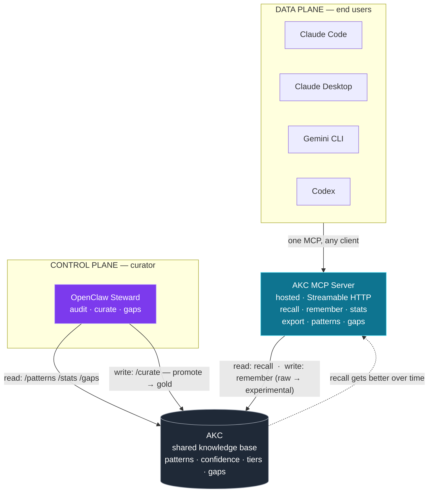
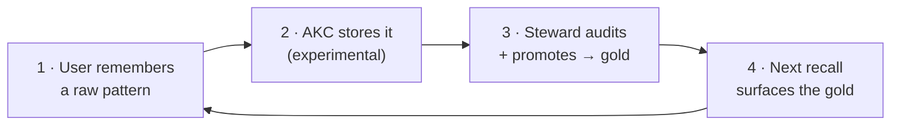

# AKC — Architecture (for pitch)

**One MCP is the only thing users plug in. Behind it, AKC remembers and OpenClaw curates — a loop that makes team memory get smarter on its own.**

## System — two planes meeting at AKC

*Users only ever touch the MCP. OpenClaw is **not** a user channel — it governs the KB behind the scenes. The two never talk directly; they meet **through AKC**.*

## Flywheel — self-improving memory

*Plant → cultivate → harvest → richer soil. The more the team uses it, the smarter it gets — with zero manual curation by users.*

## Live

| Component | Role | Endpoint |
|-----------|------|----------|
| AKC backend | shared memory + API | `endpoint-30123c53…vngcloud.vn` |
| AKC MCP (hosted) | the single user-facing surface | `endpoint-8976bc68…vngcloud.vn/mcp` |
| OpenClaw Steward | autonomous curator | OpenClaw chat (steward workspace) |
